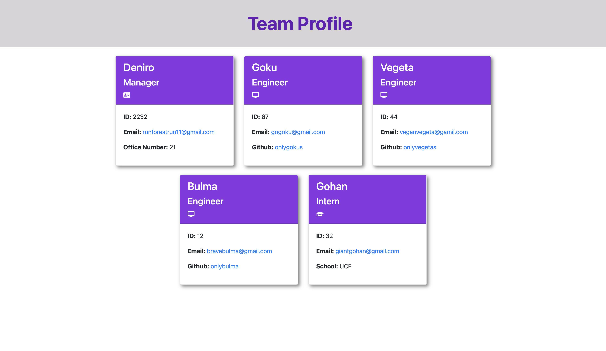

# Team Profile Generator 

## Table of Contents
* [Installation & Instructions](#installation)
* [Usage](#usage)
* [Author](#author)
* [License](#license)
* [Contributing](#contributing)
* [Tests](#tests)
* [Questions](#questions)

## Description 
This project uses Node command-line application that takes in information from the user to create a team of employees,software engineers and interns, generating HTML webpage with Bootstrap that displays summaries of each person. This project demonstrates the use of OOP and TDD using Jest as well.

## Usage 
Use inquirer from your command line to answer questions about your project. 
 View full tutorial video [here](https://drive.google.com/file/d/108-SP-3T8hdGchOvzo9eFONYouNY6Pt-/view) 

## Installation & Instructions
Clone the repository from GitHub and download Node is required. This project also requires a file system and inquirer module. Jest package is recommended for testing. Use `npm i` to install required packages once cloned to local, then run `npm run test` to test the objects created in lib folder. Then run `npm run start` to activate inquirer, then proceed on with the following questions to complete this project.

## License 
This project is license under MIT

## Contributing 
Contributors should read the installation section. 

## Tests
Run `npm run test` to run Jest for tests on constructors. 

## Author
Sole Author: DeNiro Dumas

## Questions
If you have any questions about this projects, please contact me directly at dumasdj23@gmail.com 
#### You can view more of my projects at: https://github.com/onlydeniros